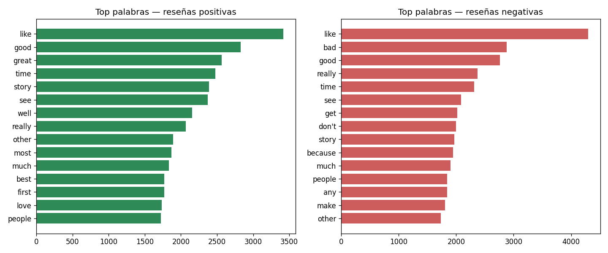

#  Sentiment Analysis — Classical NLP vs. Transformers

Comparing a classical NLP approach (TF-IDF + Logistic Regression) against a modern
transformer-based model (DistilBERT) for sentiment classification, on 50,000 real
IMDB movie reviews.

## Why this project

My [energy demand forecasting](https://github.com/Moidah/energy-demand-forecasting)
and [customer churn prediction](https://github.com/Moidah/customer-churn-prediction)
projects cover regression and classification on structured, tabular data. This one
covers unstructured text — a genuinely harder problem, and one directly relevant to
ML-driven document and text understanding.

The core question this project answers: **when is it actually worth using a
pre-trained language model instead of a classical NLP approach?** That's the exact
trade-off any team has to weigh before adopting an LLM-based solution instead of a
simpler, faster classical one.

## What it covers

- Text cleaning (HTML tag removal, whitespace normalization)
- Exploratory analysis: review length distribution, most frequent words per class
- Two approaches compared head-to-head, on the exact same test sample for a fair comparison:
  - **Classical**: TF-IDF (unigrams + bigrams) + Logistic Regression
  - **Modern**: DistilBERT (`distilbert-base-uncased-finetuned-sst-2-english`),
    pre-trained and fine-tuned for sentiment, via Hugging Face Transformers
- Evaluation with Accuracy, Precision, Recall, and F1
- Error analysis: specific cases where each model succeeds or fails

## Results

| Model | Accuracy | Precision | Recall | F1 |
|---|---|---|---|---|
| TF-IDF + Logistic Regression (full 10,000-review test set) | 0.902 | 0.896 | 0.908 | 0.902 |
| TF-IDF + Logistic Regression (same 500-review sample as transformer) | 0.912 | 0.890 | 0.940 | 0.914 |
| DistilBERT (500-review sample) | *(fill in after running `02_modeling.py`)* | | | |

*(Update this table with your DistilBERT numbers — see `outputs/resultados_modelos.csv`.)*


## Key EDA findings

- Reviews average 229 words (median: 171), with some outliers exceeding 800 words.
- Even simple word-frequency analysis shows clear signal: "great", "best", "love"
  dominate positive reviews; "bad", "don't" dominate negative ones — before any
  modeling is applied.



## Why compare instead of just using the "best" model?

A more complex model isn't automatically the right choice. TF-IDF is fast to train
(~28 seconds on 40,000 reviews) and already reaches over 90% accuracy. DistilBERT
understands word order and context (e.g., distinguishing "not bad" from "not good"),
but is far slower on CPU inference. This project measures both the accuracy *and*
the speed trade-off, rather than assuming a language model is always worth the cost.

## Project structure

```
nlp_project/
├── data/
│   ├── descargar_dataset.py      # Downloads the real IMDB dataset (~64MB)
│   └── imdb_reviews.csv          # 50,000 labeled movie reviews (IBM/public dataset)
├── notebooks/
│   ├── 01_eda.py                 # Text cleaning + exploratory analysis
│   └── 02_modeling.py            # TF-IDF+LogReg + DistilBERT + comparison
├── outputs/                      # Generated charts and results
└── requirements.txt
```

## How to run it

```bash
pip install -r requirements.txt

cd data
python descargar_dataset.py

cd ../notebooks
python 01_eda.py
python 02_modeling.py
```

Note: the first run of `02_modeling.py` downloads the DistilBERT model (~260MB)
automatically and requires an internet connection. CPU inference on the 500-review
sample takes a few minutes.

## Data source

[IMDB Dataset of 50K Movie Reviews](https://github.com/IBM/telco-customer-churn-on-icp4d) —
one of the most widely used real-world datasets for practicing text classification.

## Next steps

- Fine-tune DistilBERT specifically on this dataset instead of using it as-is
- Add explainability with LIME or SHAP for individual predictions
- Test both approaches against hand-written ambiguous/sarcastic reviews
- Compare against a general-purpose LLM API (e.g., Claude, GPT) with a simple prompt

## Tech stack

Python · pandas · scikit-learn · Hugging Face Transformers · PyTorch
